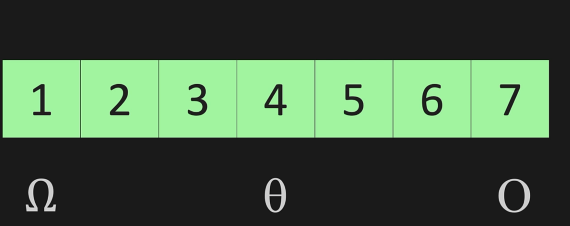
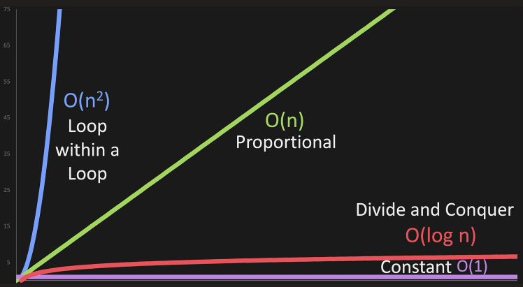

# Big O

Way of comparing 2 sets of code..
Comparing code 1 and code 2 mathematically, about how efficient they run.

## <u><b>*Time complexity*</b></u>

Code 1 : 15 secs, code2 : 60 secs.. Therefore code 1 is efficient
But this depends on computer (faster comp runs the code faster)

## <u><b>*Space complexity*</b></u>

Amount of space it takes..
Maybe code 1 takes more memory, and code 2 takes less memory.. Therefore in terms of space complexity, code 2 is belter

## <u><b>*Three alphabets for complexity*</b></u>
 
Best case scenario : Omega
Average case : theta
Worst case : O

When talking about Big O, we talk about Worst case

O(n) : proportional complexity : Linear complexity
As n increases, O(n) linearly increases

## <u><b>*Drop non-dominants*</b></u>

If a code runs in O(n^2 + n) times, we can consider it as O(n^2).
We can drop the non-dominant term "n"

## <u><b>*Constant time*</b></u>

O(1) is constant time..
O(2) O(3) is all O(1)
Most efficient Big O.. This is the most optimal code that we can make it.

O(log n) : 

In order to find a number from a list, if we divide the list into half each time we find it, the complexity is O(log n)

## <u><b>*Complexity on a list*</b></u>

Lst.append : O(1)
Lst.pop : O(1)

If we have to remove/add any element to the end of a list , the complexity is O(n)

If we have to remove/add element to the beginning of a list, then the complexity is O(n) because reindexing has to take place.

If we remove/add elements to the middle of a list, then it is in between O(1) and O(n).. Hence the worst case is O(n)

If we have to search an element by value in a list, the complexity is O(n)
If we have to search a list based on index, it is O(1) because we can directly access that particular element in memory in the list

## <u><b>*Big O cheet sheet*</b></u>

[Big O Cheet sheet](https://www.bigocheatsheet.com/)

